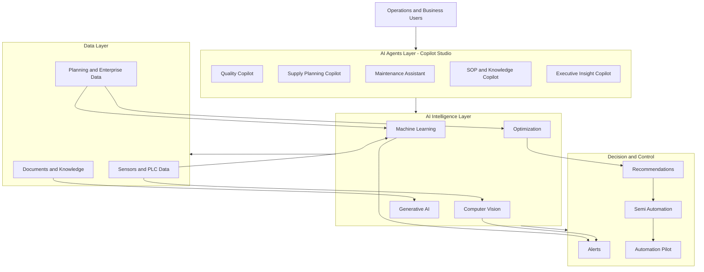

 

<h2 align="center">AI Solution Architect | Industrial AI | Data Scientist</h2>

Applied AI for Manufacturing, Supply Chain, Quality, and Operations. 
Background in Data Science, Machine Learning, Computer Vision, and Sustainability Research.

---

## 🧠 About Me

I am a passionate AI specialist and data scientist interested in exploring data and extracting knowledge insights.

I design and deploy AI systems for manufacturing operations including predictive maintenance, supply planning, quality intelligence, computer vision, and generative AI knowledge automation.

Experience spans:
- Industrial AI deployment
- Machine learning modeling
- Computer vision
- Generative AI & Copilot agents
- Sustainability and environmental analytics

---

## 🏭 Industrial AI Architecture (Conceptual)

Conceptual reference architecture for industrial AI deployment.  
No confidential systems, parameters, or datasets are included.

---

## 🔥 Featured Industrial AI Projects

### Predictive Maintenance
- Vibration analytics & anomaly detection
- LSTM forecasting for equipment behavior

### Supply Chain & Planning AI
- ATP (Available-to-Promise)
- Backorder intelligence
- Inventory visibility & demand–supply analysis

### Quality & Process AI
- Property prediction models
- QC Smart Management
- Thickness control optimization

### Vision AI & OCR
- Slurry inspection
- Tag recognition automation

### Generative AI & Knowledge
- SOP generation platform
- Training automation
- Insight reporting

---

## 🏭 Industrial AI Skills

- Predictive Maintenance (Vibration Analytics, LSTM Forecasting)
- Machine Learning–Based Anomaly Detection
- AI-Driven Supply Planning & Inventory Intelligence
- Quality Intelligence & Property Prediction
- Vision AI Inspection
- OCR for Industrial Tag Recognition
- AI-Based Process Parameter Optimization
- Autonomous / Semi-Automatic Control (Pilot)
- Generative AI for SOP & Training Automation
- Operational Insight Generation

---

## 🧰 Tools & Technologies

### Industrial AI & Machine Learning
- Python
- Scikit-learn
- TensorFlow
- PyTorch
- Time-series modeling (LSTM)
- Machine learning anomaly detection

### Computer Vision
- OpenCV
- Image processing pipelines
- OCR systems

### Generative AI & Agents
- Copilot Studio
- Ollama (LLM deployment)
- Prompt engineering
- Knowledge-based AI systems

### Data & Integration
- SQL / MSSQL
- Data pipelines
- ETL workflows
- Operational data integration
- API integration

### MLOps & Deployment
- Model deployment in production
- AI workflow automation
- Monitoring & feedback loops
- Git version control

### Industrial & Operational Systems
- Sensor data integration
- Process monitoring systems
- Planning & supply data workflows

### AI Capabilities
- Predictive maintenance
- Supply chain intelligence
- Quality prediction
- Process optimization
- Autonomous control (pilot)

---

## 💻 Programming Languages

- Python
- SQL
- MATLAB
- C++
- PHP
- JavaScript

---

## 🤖 AI & Data Science Techniques

- Deep Learning
- Machine Learning
- Artificial Intelligence
- Computer Vision
- Time-Series Forecasting
- Optimization
- Data Visualization
- Statistics

---

## 📚 Previous Data Science Applications

### Marketing
https://github.com/tanriders/Flight_Price_Preiction  
https://github.com/tanriders/customer-segmentation-k-means  
https://github.com/tanriders/Automobile-Customer-Segmentation  
https://github.com/tanriders/Recommend_movies  

### Finance
https://github.com/tanriders/Fraud_Detection_AutoEncoder  

### Transportation
https://github.com/tanriders/Traveling-Salesman-Problem  
https://github.com/tanriders/Vehicle-Routing-Problem-VRP-  

### Medical
https://github.com/tanriders/Medical_Brain-Tumor-MRI-Classification-GoogLeNet  

### Construction
https://github.com/tanriders/Construction_Building-Energy-Prediction-models  

### Agriculture
https://github.com/tanriders/Agriculture-Crop-Yield-Prediction  

### Environment
https://github.com/tanriders/Berkeley-Earth_PM2.5-Forecasting-In-Bangkok  
https://github.com/tanriders/PM2.5-Forecasting-In-Bangkok  

---

## 📫 Contact
GitHub: https://github.com/tanriders
